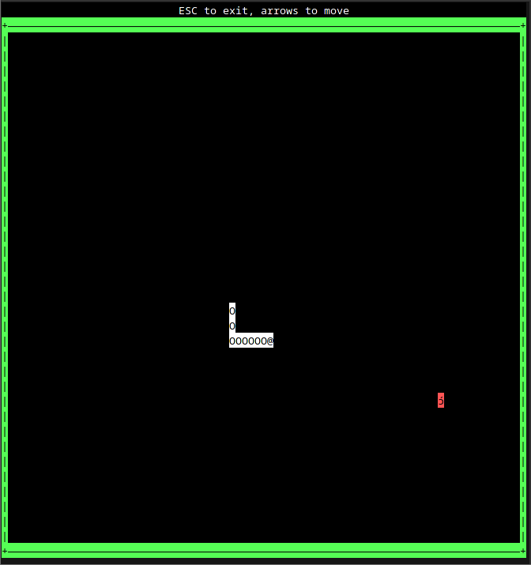

# andiskaz
Andiskaz "endish", an asynchronous terminal library for TUI applications and
games

# Main Branch Docs

https://brunoczim.github.io/andiskaz/andiskaz/

# Features

## `plane`

Enable this to make `andiskaz`'s `Vec2` be an alias for the crate `gardiz`'s
`Vec2`. Otherwise, `andiskaz`'s `Vec2` is a new struct.

# Example Snake Game

See [this folder](./examples/snakegame/).

